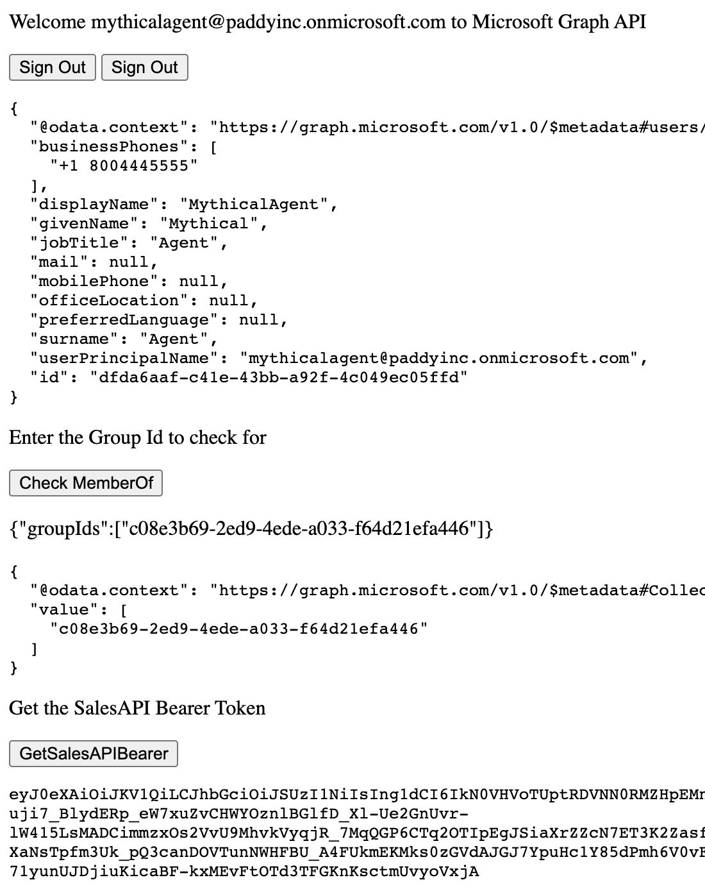

Adapted from [Code Samples](https://github.com/azure-samples/)
# Call Graph API from a JavaScript Single Page Application using msal.js
===========================================================

This code demonstrates 3 concepts
* Acquiring Microsoft Graph Token for User.Read, Group.Read.All, User.Read.All
* Acquiring token for a Custom API with scope of Sales.Read
* Checking if the logged in user is member of a given security groups

Bug:
Click twice on the GetSalesAPIBearer....

 
